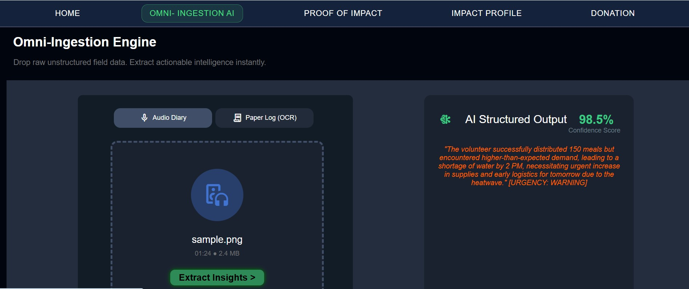
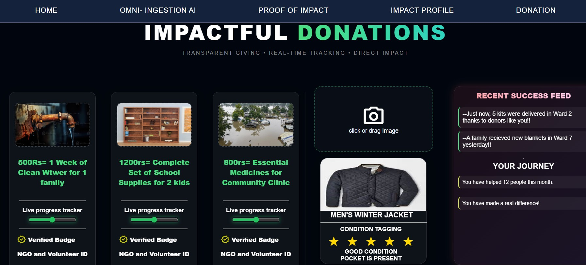
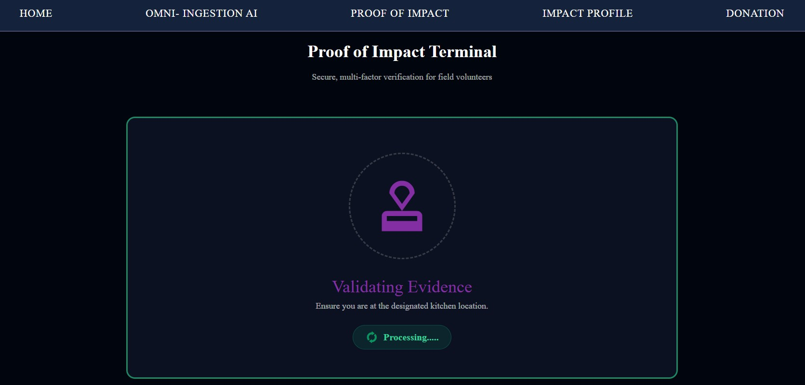

<div align="center">

# 🌍 PulseNet: Proof of Impact (PoI) Terminal
**By Team ByteNova | Google Solution Challenge 2026**

[]()
[]()
[]()
[]()
[]()

*PulseNet is a Multi-Modal Intelligence Engine built to tackle UN SDG 2 (Zero Hunger) by turning unstructured field chaos (voice, photos, paper) into structured action.*

<br>

[](https://bytenova.onrender.com)

</div>

---

## 🛑 The Problem
1. **The "Paper Grave"**: In Delhi, community needs aren't captured in spreadsheets; they are trapped in damp notebooks and messy voice notes. 
2. **Language Barriers**: Field reports are often in "Hinglish," making them hard for standard software to parse.
3. **Ghost Volunteers**: NGOs suffer from high operational churn when people sign up for the clout but don't show up.
4. **Reactive Operations**: NGOs only react to today's problem, missing the patterns of tomorrow's crisis.

---

## 💡 The Solution: Proof, Not Promises
PulseNet provides an immutable, trust-based ecosystem where you only get credit if you are physically there. We own the Reputation Layer by converting field work into a portable professional identity.

### ✨ Key Features

#### 🧠 Omni-Ingestion Engine (Multimodal AI)



* **Audio Diaries**: Field workers record voice notes (Hinglish/Hindi). The Gemini AI instantly transcribes, translates, and extracts the core need, outputting a strict JSON format with an automated Urgency Score and Confidence Rating. 
* **Context-Aware OCR**: Respects the "Paper Workflow" by allowing NGOs to snap photos of handwritten logs. The AI structurizes visual data into clean, audit-ready data streams.

#### 📦 Donation AI Tagging



* **Smart Inspection**: Upload a photo of a donated item, and the AI automatically inspects it, extracting the item type, condition, and specific details to maintain transparent giving.

#### 🛡️ Proof of Impact (PoI) & Reputation Layer



* **Soulbound Tokens (SBT)**: We mint a permanent, non-transferable digital badge only when a volunteer's GPS matches the task location and the recipient scans their QR code. 
* **Data-Backed Impact Certificate**: Generates certificates showing quantitative achievements (e.g., hours served) and verified skills.
* **Automated Security Tier**: Integrates e-KYC to verify identities and scans Indian e-courts for past convictions to ensure community safety.

#### 🗺️ Smart Operations & Live Mapping


* **Live Operations Heatmap**: An interactive React-Leaflet dashboard that maps live incidents, critical zones, and operational nodes across the city in real-time.
* **Smart Evidence Score**: AI cross-references visual data with location patterns to provide a proven "Urgency" rating. 
* **Dynamic Standby Management**: Uses a 12-hour "Confirmation Pulse" to rank waitlisted volunteers by reliability and automatically reassign slots if a volunteer backs out.

---

## 🛠️ The Tech Stack

Our architecture is a sleek, monolithic full-stack application designed for maximum performance:

* **The Engine (Backend)**: Built on **Python / Flask**, utilizing the `google-genai` SDK to route files securely through the Gemini 2.5 Flash model.
* **The Pulse (Frontend)**: **HTML5/CSS3/JavaScript**, featuring dynamic DOM manipulation and a seamlessly injected **React-Leaflet** interactive map.
* **The Vault (Database)**: **Firebase Firestore** for real-time tracking of volunteer profiles, PoI tokens, and live dashboard statistics.
* **The Cloud (Deployment)**: Hosted live on **Render** using a production-grade Gunicorn WSGI server.

---

## 🚀 Getting Started (Run it Locally)

### Prerequisites
* Python 3.10+
* Google Gemini API Key (Get one free at [Google AI Studio](https://aistudio.google.com/))

### Installation
1. Clone the repository:
   ```bash
   git clone [https://github.com/ananyajoshi-cseai/ByteNova.git](https://github.com/ananyajoshi-cseai/ByteNova.git)
   cd ByteNova
2. Install the required Python dependencies:
   ```bash
   pip install -r requirements.txt
3. Create a .env file in the root directory and add your Gemini API Key:
   ```bash
   GEMINI_API_KEY=your_key_here
4. Run the Flask server:
   ```bash
   python app.py

## 👥 Meet Team ByteNova
* **Ananya Joshi** - Backend Architecture (Python/Flask), AI Integration (Gemini API), GitHub Version Control & Cloud Deployment (Render)
* **Gargi Sharma** - Interactive Heatmap & Live Mapping UI (React-Leaflet)
* **Anika Aggarwal** - Lead Frontend Developer (Core UI/UX & Primary Page Architecture)
* **Aashi Srivastava** - Frontend Support, Project Documentation, Pitch Deck (PPT) & Quality Assurance
